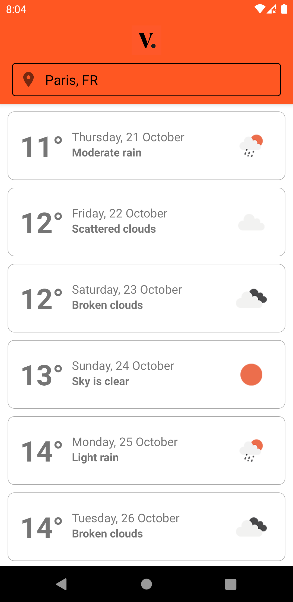
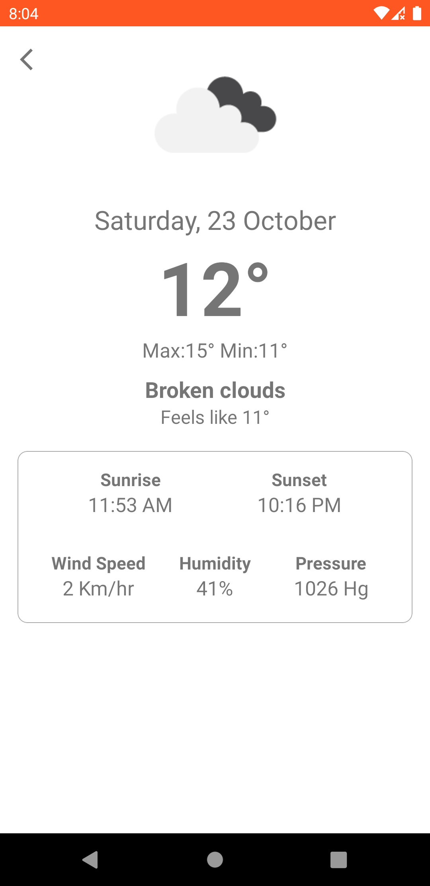
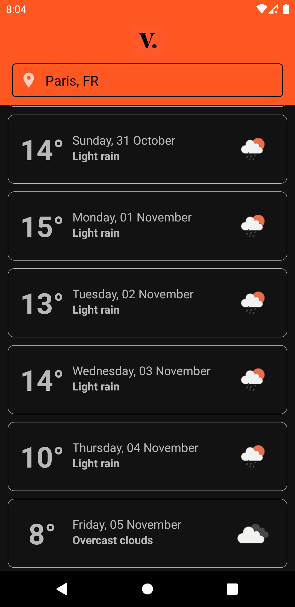
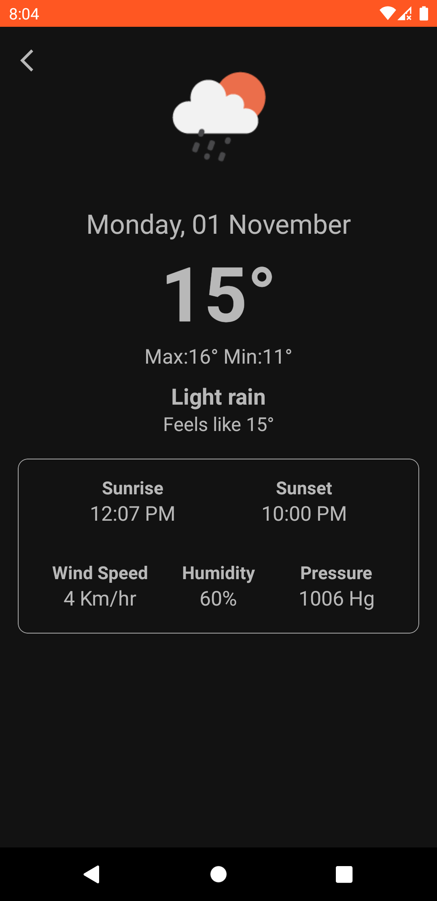

# My-Vestiaire-Weather-Android-Assignment
This repository contains source-code for mobile-app-coding-challenge provided by Vestiaire Collective.

## Getting Started
- Clone the repository
- Import the project in Android Studio
- Add your own `API-KEY` in `Constants.kt` file
- Go to Build > Make Project
- Go to Run > Run 'app'
- Voila!

## Tech-Stack
- Kotlin & MVVM
- Retrofit (for API calls)
- RoomDB (for caching)
- Hilt (for dependency injection)
- Material Design (for theming)
- JUnit (for testing)

## Objectives
Develop a native application containing at least the following elements :
  - A list view displaying 16 days weather forecast for Paris.
  - A detail view displaying a maximum of informations for a specific day's weather
  - On the detail view, display "Hot" if temperature is > 25°C, "Cold" if temperature <
10°C.
  - Once weather data is downloaded, user can access it offline.

## Screenshots
   